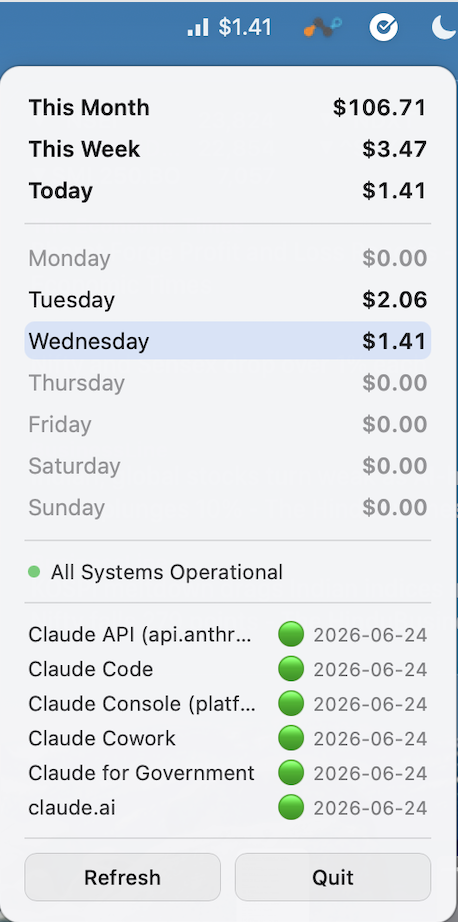

# CCUsage Menubar App



Fork of [ccusage-macos-menubar](https://github.com/6/ccusage-macos-menuba))

## Overview

This is a minimal Tauri v2 application that runs as a menubar-only app on macOS. The app:
- Runs without a visible window on startup (no dock icon)
- Shows only in the macOS menubar (system tray)
- Displays Claude Code usage costs from the ccusage CLI
- Shows daily/weekly/monthly cost totals in a small popover window

## Architecture

### Backend (Rust)
- **src-tauri/src/lib.rs**: Main application logic
  - Sets up the system tray icon
  - Integrates with the ccusage CLI via `ccusage daily --json` (tries `npx ccusage@latest` and a global `ccusage` install across several PATH fallbacks)
  - Parses the JSON, caches it in a static `APP_CACHE`, and computes the stats payload
  - Exposes Tauri commands consumed by the webview
  - Toggles the popover window on left-click and positions it under the tray icon
  - Sets the macOS activation policy to `Accessory` (no dock icon)

### Frontend (React)
- **src/App.tsx**: The popover UI. Fetches stats via the `get_stats` command, re-fetches when the backend emits the `stats-updated` event, and renders the cost table. Has Refresh/Quit buttons.
- **src/App.css**: Popover card styling (rounded corners, light/dark via `prefers-color-scheme`, right-aligned tabular numbers).

### Configuration
- **src-tauri/Cargo.toml**:
  - `tauri` with `tray-icon`, `image-png`, `macos-private-api` features
  - `tokio` (process, time) for async ccusage execution
  - `serde` / `serde_json` for JSON parsing
  - `chrono` for date math (today / current week / current month)
- **src-tauri/tauri.conf.json**:
  - A single hidden `main` window: `visible: false`, `decorations: false`, `transparent: true`, `alwaysOnTop: true`, `skipTaskbar: true`
  - `macOSPrivateApi: true` (required for the transparent popover)

### Dependencies
- **ccusage CLI**: Required external dependency
  - Install with `npm install -g ccusage`, or it falls back to `npx ccusage@latest`
  - Requires Node.js on the user's machine

## How It Works

### Tray icon
- **Left-click** toggles the popover window, positioned directly below the icon
- **Right-click** opens a small action menu: **Refresh**, **Debug Info**, **Quit** (Cmd+Q)
- The tray **title** shows today's total cost (e.g. `$7.93`) when there is any usage today, otherwise it is empty
- The icon uses `icon_as_template(true)` so it adapts to light/dark menubar

### Popover window
The popover is a borderless, transparent webview showing:
```
CCUsage
─────────────────────────
This Month            $824.27
This Week              $81.32
Today                   $7.93
─────────────────────────
Monday                 $16.00
Tuesday                 $8.32
Wednesday               $6.49
Thursday               $42.57
Friday        (today)   $7.93
Saturday                $0.00
Sunday                  $0.00
─────────────────────────
[ Refresh ]   [ Quit ]
```
- Today's row is highlighted; `$0.00` days are dimmed
- Numbers are right-aligned with tabular figures (perfect column alignment — this is why stats live in a webview rather than in native menu items, where a proportional font + tab stops cannot align reliably)
- The window hides automatically when it loses focus (clicking elsewhere). A short timestamp guard prevents the dismiss-click on the tray icon from immediately reopening it.

### Data flow
- `ccusage daily --json` returns one entry per day (`period`, `totalCost`)
- `compute_stats()` derives, from the cached entries:
  - **This Month** = sum of entries in the current `YYYY-MM`
  - **Today** = current day's `totalCost`
  - **This Week** = sum over Monday–Sunday of the week containing today
  - **days** = the 7 days of the current week (Mon–Sun), each with cost + `isToday`
- Refresh happens on startup, every 2 minutes, on manual Refresh, and whenever the popover is shown. After a refresh the backend emits `stats-updated` so the open webview updates live.

### Tauri commands
- `get_stats` → returns the `StatsPayload` (month/today/week totals + per-day breakdown + availability flags)
- `refresh_now` → forces an immediate ccusage refresh
- `quit_app` → exits the app
- `debug_info` → returns environment / PATH / ccusage availability diagnostics (also reachable from the right-click "Debug Info" item, which prints to stdout and shows an `osascript` dialog)

### Error / empty states
- **ccusage not found** → the popover shows "ccusage not found" with an `npm install -g ccusage` hint
- **No data yet** → shows "Loading…"

## Build & Run

### Prerequisites
Install the ccusage CLI (or rely on `npx`):
```bash
npm install -g ccusage
# verify:
npx ccusage@latest daily --json
```

### Development
```bash
yarn
yarn tauri dev
```
No window appears on launch — look for the icon in the menubar and left-click it.
(Dev server runs on port 1420; if it's stuck, `lsof -ti:1420 | xargs kill`.)

### Production Build
```bash
yarn tauri build
# Apple Silicon only:
yarn tauri build -- --target aarch64-apple-darwin
# Output: src-tauri/target/release/bundle/dmg/
```

## GitHub Actions Release Workflow

The project includes a GitHub Actions workflow for automated releases. No Apple Developer account required.

1. Go to the Actions tab on GitHub
2. Select the "Release" workflow → "Run workflow"
3. Enter a version (e.g. `1.0.0`, without the `v` prefix)
4. The workflow updates the version in Cargo.toml and tauri.conf.json, builds for Apple Silicon (ARM64), and creates a draft release with the DMG.

### First Run Instructions
The app is not code-signed, so macOS may report it as "damaged" when downloaded from GitHub releases.

```bash
# After moving the app to /Applications:
xattr -cr /Applications/ccusage-menubar.app
```
Alternatively, right-click the app → "Open" → "Open" in the dialog. This is only needed once; it's the standard macOS behavior for unsigned apps from the internet.

## Notes

- Stats UI is a webview popover, not native menu items (the previous menu-based layout could not align the cost column in a proportional font).
- The tray icon comes from `src-tauri/icons/bars.png` and is rendered as a template image.


